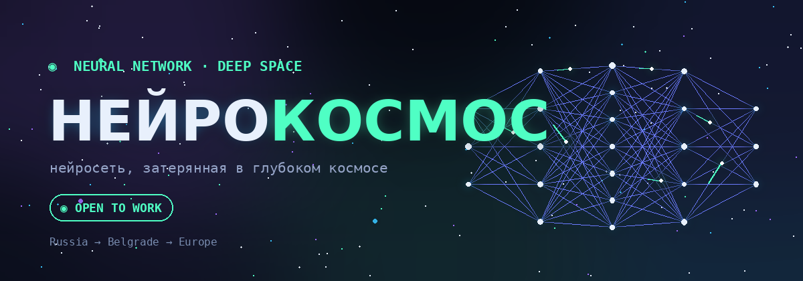

<div align="center">



# ◉ НЕЙРОКОСМОС

**Нейросеть, затерянная в глубоком космосе.** Узлы как звёзды, сигналы как свет между ними.


<b>Живой сайт →</b> <a href="https://chrisredfield48.github.io/nip.sys/">chrisredfield48.github.io/nip.sys</a>

</div>

---

Одностраничник с живым визуалом: настоящая нейросеть, плавающая в глубоком космосе. Слои узлов-звёзд светятся в туманности, по рёбрам бегут импульсы — **прямой проход мятный, обратный пурпурный**. Сцена реагирует на курсор, узлы вспыхивают, когда сигнал доходит. Сеть не уходит после первого экрана — она остаётся живым фоном всего сайта, а контент скроллится поверх в полупрозрачных панелях.

## Что внутри

```
  ◉  живая нейросеть на canvas — прямой / обратный проход
  ◉  псевдо-3D глубина: узлы по depth, параллакс от курсора
  ◉  клик по пустому космосу — всплеск сигналов от ближайшего узла
  ◉  5 блоков: герой · манифест · пункт назначения · проекты · контакт
  ◉  prefers-reduced-motion — статичный кадр вместо анимации
  ◉  адаптив до мобилы · фокус с клавиатуры
```

## Стек

Чистый ванильный фронтенд. Без зависимостей, без сборки, без фреймворков.

```text
html · css · javascript (es6)
canvas 2d — свечение через кэш-спрайты (летает и на телефоне)
шрифты — syne + jetbrains mono (google fonts)
интерфейс на русском
```

## Структура

```text
nip.sys/
├── index.html        разметка и весь контент
├── style.css         палитра, типографика, панели, плашка, карточки
├── script.js         движок сети + ui (навигация, reveal)
└── assets/
    ├── banner.png    превью для соцсетей и шапки README
    └── favicon.svg   иконка вкладки
```

## Запуск

```bash
python3 -m http.server 8000
# http://localhost:8000
```

> Статика без сборки: открыть `index.html` двойным кликом обычно работает, но если через `file://` не подхватятся стили — запусти локальный сервер командой выше.

## Как обновлять

#### Проекты — блоки `.card` в `index.html`

Карточка проекта: заголовок, описание, теги, ссылка.

```html
<a
  class="panel card rv"
  href="https://..."
  target="_blank"
  rel="noopener noreferrer"
>
  <div class="card-top">
    <span class="idx">01</span
    ><span class="stat"><span class="d"></span>задеплоено</span>
  </div>
  <h3>Название</h3>
  <p>Короткое описание.</p>
  <div class="tags">
    <span class="tag">HTML</span><span class="tag">CSS</span>
  </div>
  <span class="open">открыть <span aria-hidden="true">→</span></span>
</a>
```

#### Манифест — блок `.note` в `index.html`

Абзац от первого лица. Голос — твой, правится прямо в разметке.

#### Пункт назначения — блок `.dest` в `index.html`

Плашка-навигация: город, координаты, строка плана. Сейчас — Белград (`44.81° N · 20.46° E`).

#### Палитра — переменные в `style.css`

Все цвета в `:root`: `--mint` · `--sky` · `--purple` · `--peri` · `--void`. Меняешь здесь — меняется весь сайт.

#### Параметры сети — `script.js`

- плотность слоёв: массив `sizes` в `buildNet()` — `[5,8,11,8,5]` (десктоп) и `[4,6,8,6,4]` (мобайл)
- частота импульсов: в `frame()` — прямой проход каждые `1700` мс, обратный каждые `5400` мс

## Деплой

GitHub Pages: **Settings → Pages**, ветка `main`, папка `/ (root)`. Сайт статический — пушнул и готово.

Превью для соцсетей и Telegram уже настроено в `index.html` — Open Graph и Twitter Card, баннер подтянется автоматически. Если переименуешь репозиторий, поправь абсолютные ссылки в `index.html`: `canonical`, `og:url`, `og:image`, `twitter:image`.

---

<div align="center">
<sub>◍ &nbsp; © 2026 Nikita Ip · НЕЙРОКОСМОС · Russia → Belgrade → Europe &nbsp; ◍</sub>
</div>
