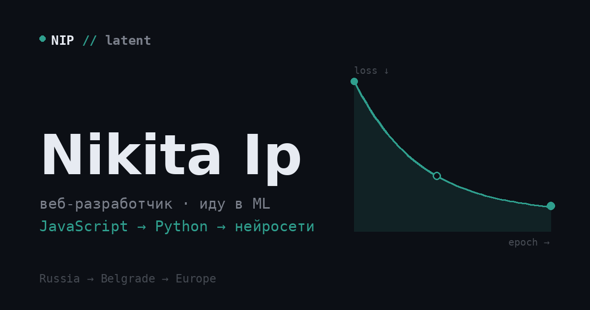

<div align="center">



<p><i>training run — из веба в Python и нейросети</i></p>

<p>


</p>

<p><b>Живой сайт →</b> <code>https://chrisredfield48.github.io/&lt;repo&gt;/</code></p>

</div>

---

Личный сайт. Карта того, где я сейчас и куда иду. Вместо витрины достижений — **кривая обучения**: `loss` здесь это расстояние до цели, и чем дальше я иду, тем ниже он падает. Статусы навыков (`учу` · `в очереди` · `позже`) — честные, а не парадные. Сайт обновляется вместе со мной.

| epoch | этап | статус |
|:-----:|------|--------|
| `e0` | html · css | готово |
| `e1` | javascript | **← сейчас** |
| `e2` | python | дальше |
| `e3` | математика · линал, матан, вероятность | параллельно |
| `e4` | ml / нейросети — от регрессии до трансформеров | цель |
| `e5` | relocate → europe | цель |

---

## Стек

Чистый ванильный фронтенд. Без зависимостей, без сборки, без фреймворков.

```text
html · css · javascript (es6)
шрифты — sora + ibm plex mono (google fonts)
интерфейс на русском
адаптив · доступность с клавиатуры · prefers-reduced-motion
```

## Структура

```text
.
├── index.html    разметка и весь контент — заметка, стек, проекты, модели, путь
├── style.css     палитра, типографика, сетки
├── script.js     рендер проектов и моделей, точки на кривой, навигация, меню
└── image/
    ├── og.png        превью для соцсетей (1200×630)
    └── favicon.svg   иконка вкладки
```

## Запуск

Открыть `index.html` двойным кликом достаточно. Чище — через локальный сервер:

```bash
python3 -m http.server 8000
# http://localhost:8000
```

## Как обновлять

Контент живёт в двух местах: **данные** (проекты, модели) — в `script.js`, **структура** (заметка, стек, вехи, кривая) — в `index.html`.

#### Проекты — массив `projects` в `script.js`

```js
{ cat:'js', status:'shipped', title:'Название', icon:'[ ui ]',
  desc:'Короткое описание.',
  tags:['HTML','CSS','JS'], link:'https://...' }
```

Без `link` карточка покажет «скоро». Все карточки рендерятся одной сеткой — вкладок-фильтров сейчас нет, поле `cat` лежит про запас и ни на что не влияет.

| `status` | на карточке |
|----------|-------------|
| `shipped` | задеплоено |
| `dev` | в разработке |
| `plan` | в планах |

#### Модели — массив `models` в `script.js`

```js
{ schem:'cnn', level:3, status:'plan', name:'CNN',
  desc:'Свёртки и пулинг.' }
```

`schem` — схема архитектуры: `reg` · `mlp` · `cnn` · `rnn` · `tr`. `level` — сложность `0–5`, рисует точки.

| `status` | подпись |
|----------|---------|
| `next` | следующий |
| `plan` | в планах |
| `lock` | заблокирован |

#### Личная заметка — блок `.intro-note` в `index.html`

Абзац от первого лица сразу под именем. Голос — твой, правится прямо в разметке.

#### Стек — секция `#stack` в `index.html`

У каждого навыка `data-level="0–5"` на `<span class="lvl">` и статус-текст в `<span class="st ...">`: класс `accent` для активного, `muted` / `faint` для остального.

#### Вехи — блоки `.ms` (`e0`–`e5`) в `index.html`

Этап пройден — меняешь бейдж, например `now` → `done`:

```html
<span class="ms-badge done">готово</span>
```

Варианты: `done` · `now` · `next` · `goal`.

#### Кривая

Линия — это SVG-`path` в `index.html` (`id="curveLine"`, атрибут `d`). Точки-вехи `script.js` расставляет по линии сам — подстроятся под любую форму.

#### Цвет акцента

Основной — переменная `--accent` в `style.css`. Цвет кривой продублирован напрямую в SVG (`index.html`) и в отрисовке точек (`script.js`) — при смене акцента поправь и там.

#### Картинки и мета

`image/og.png` — превью при шере, `image/favicon.svg` — иконка вкладки. Пути прописаны в `<head>`. Имена файлов чувствительны к регистру.

## Деплой

GitHub Pages: **Settings → Pages**, ветка `main`, папка `/root`. Сайт статический — пушнул и готово.

Для превью в Telegram замени относительный путь OG на полный — в `og:image` и `twitter:image`:

```html
<meta property="og:image" content="https://chrisredfield48.github.io/<repo>/image/og.png">
```

---

<div align="center">
<sub>личный проект, для себя · код открыт — смотри и разбирай · дизайн и контент мои</sub>
</div>